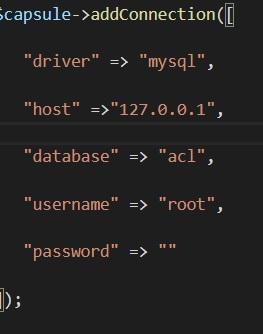
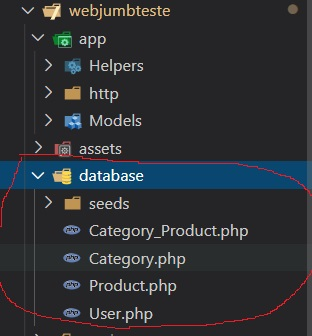

<h2>Meu teste</h2>
<small>
Eu Acabei me preucupando em montar minha estrutra php do zero como eu trabalho,
além do crud eu quis focar nessa parte então simulei um MVC onde usei o Eloquent e 
criei minha propria estrutura !

PS: Me perdi no prazo e  acobou nao saindo como eu queria , mas ficou legal o modelo
</small>

<h4>Clone o repositório</h4>
<pre> https://github.com/klzchz/webjumbteste</pre>

<h4>Instalar as dependencias </h4>
<pre> composer install</pre>

<h4>Configurações da base no arquivo boostrap.php </h4>
<pre> 
    
</pre>

<h4>Executar esses arquivos para criar as tabelas </h4>
<h6> PS: Executar os arquivos de baixo p cima essa ordem é importante</h6>
<pre> 
    
</pre>